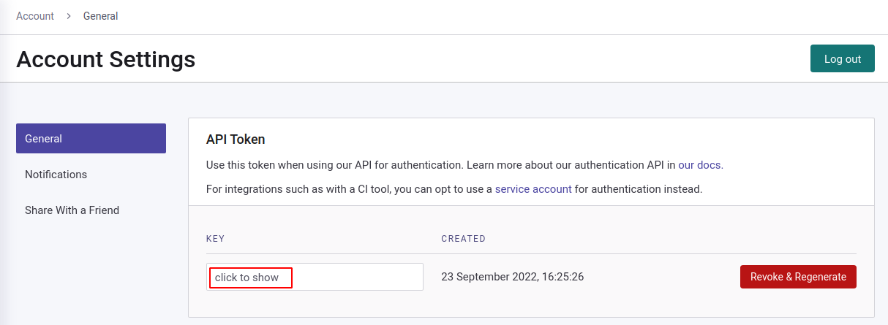
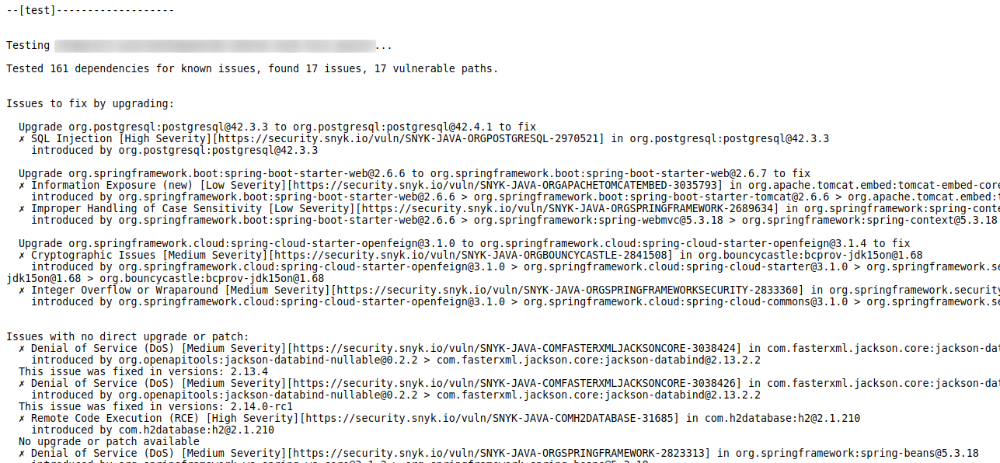
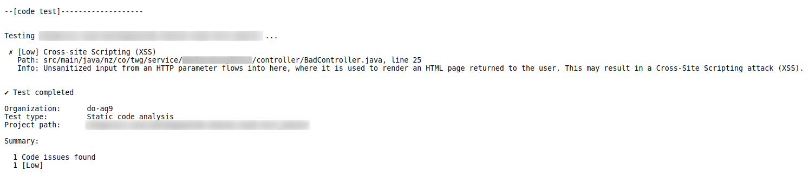
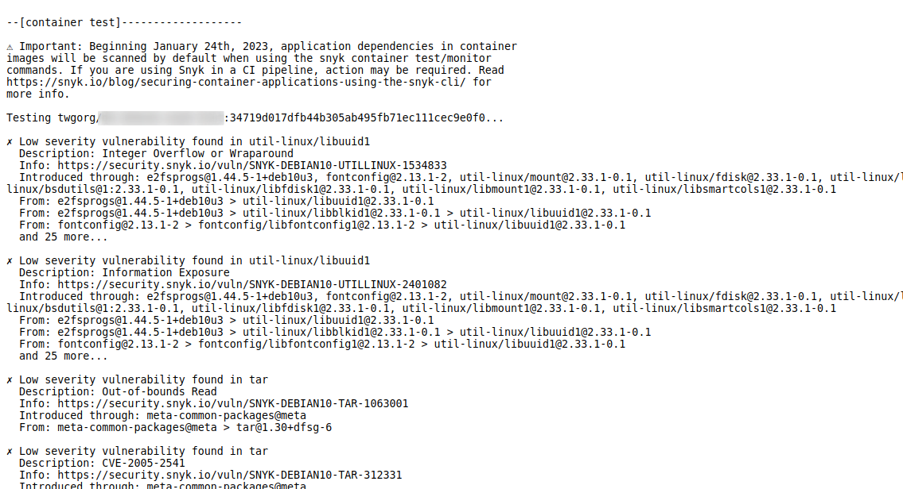
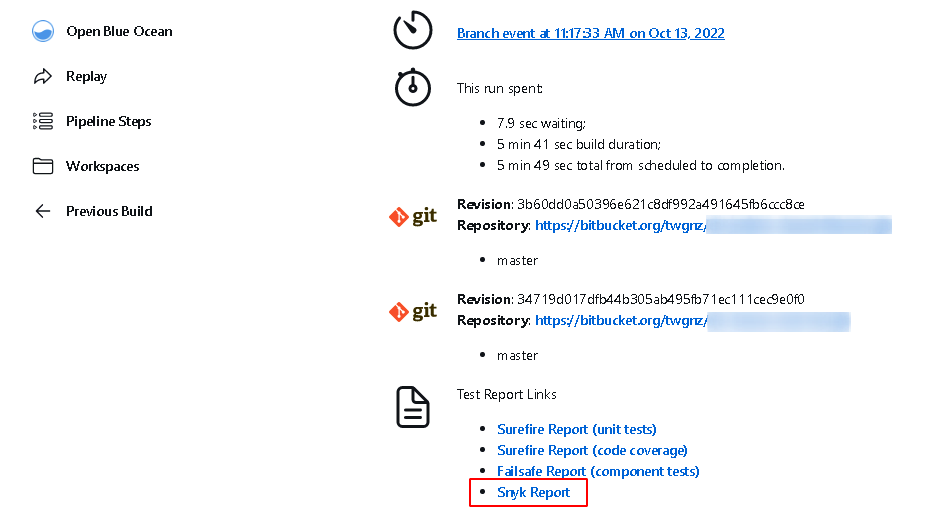

## Snyk Security

Good security is of paramount importance for an organisation like The Warehouse Group (TWG). Failures can place TWG
under ransom, damaged reputation, and resources exploited to meet criminals end. Therefore, the need for ensuring proper
security awareness, monitoring, and reporting must be put in place to detect potential vulnerabilities before _any_
exploitation occurs.

Snyk provides features that focus on vulnerability detection during the development phase, as well as continuous
monitoring of code repository and deployed containers.

### Development time
Snyk offers integration with a few popular IDE to detect dependency and code level vulnerabilities. Instructions on
how to enable in on Intellij and Visual Studio Code can be found [here](https://thewarehouse.atlassian.net/l/cp/amwmrbJg).

Official documentation on these IDE plugins can be found [here](https://snyk.io/ide-plugins/).

The `snyk-maven-plugin` is also integrated and configured in the `pom.xml` to provide local build-time vulnerability
detections.
By default, this runs the `snyk test` (dependency) and `snyk code test` (static analysis) goals for the project.

If the `jkube` profile is active and the application's docker image is created, an additional `snyk container test`
goal will be executed to check the container image layers for vulnerabilities.

For the `snyk-maven-plugin` to work properly, please ensure the `SNYK_TOKEN` environment variable contains your Snyk
token. This can be found under your account settings.

### Build time

Snyk is integrated into the build process to perform the dependency, static analysis, and container tests to generate
a combined report. This report will be uploaded to nexus to be consumed by ServiceNow and any party that may be
interested in it.

The report is divided into 3 separate sections (example below)

###### Dependency Analysis

---

###### Code Static Analysis

---

###### Container Base Image Analysis

---

The per build report can also be found on jenkins

---

#### NOTE
These reports are a snapshot of the known vulnerability at the time the build happens. Since Vulnerabilities can
retroactively be detected, these report may not be the most accurate as time passes. For more accurate results, please
consult the Snyk UI.

### Deployed artifact

The containers deployed into the Kubernetes cluster will also be monitored. These are done by a side-loaded container
living in the namespace along with all other containers of the same project group (e.g. `do`, `gbs`, `goms`, etc).

The results of these scans can be found in the Snyk UI.
